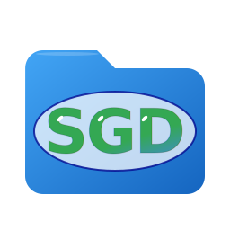

# SyncGDrive


<div align="center">
  
  <br><br>
  
</div>

Synchronisation native et unidirectionnelle d'un dossier local vers Google Drive.
L'ordinateur local est la **source de vérité** — le Drive distant sert de sauvegarde absolue.

---

## 📑 Sommaire
- [✨ Fonctionnalités](#-fonctionnalités)
- [📦 Installation](#-installation)
- [🔐 Configuration de l'API Google Drive](#-configuration-de-lapi-google-drive)
- [🚀 Utilisation](#-utilisation)
- [⚙️ Configuration Avancée & Architecture](#-configuration-avancée--architecture)
- [📄 Licence](#-licence)

---

## ✨ Fonctionnalités

* 🔄 **Scan initial intelligent** : Inventaire local et remote index BFS, re-upload uniquement des fichiers modifiés (basé sur mtime + SHA-256).
* 👁 **Surveillance temps réel** : Utilisation native d'`inotify` pour détecter instantanément les événements (`close_write`, `create`, `delete`, `rename`).
* 🚀 **Client API Google Drive Natif** : Communication directe et optimisée avec l'API Google, sans aucune dépendance externe lourde (ni KIO, ni rclone).
* 🛡 **Anti-doublon GDrive** : Remote index BFS et création de dossiers sans `stat` redondant pendant le scan.
* 💾 **Persistance SQLite** : Mémorisation locale des fichiers déjà synchronisés pour éviter les retransferts inutiles.
* 🖥 **Interface & Systray** : Fenêtre de paramétrage native GTK4/libadwaita et icône StatusNotifierItem avec menu contextuel.
* ⏸ **Gestion de l'état** : Pause/Resume manuel et pause automatique du moteur pendant l'édition des réglages.
* 🛑 **Shutdown propre** : Interception de SIGINT/SIGTERM pour un arrêt gracieux des transferts et requêtes API en cours.
* 🔒 **Instance unique** : Verrouillage strict par `flock` et fichier PID géré dans `$XDG_RUNTIME_DIR`.
* 🚀 **Service systemd** : Intégration native avec option "Lancer au démarrage" via `systemctl --user`.
* 🔐 **Sécurité OAuth2** : Implémentation complète du flux loopback PKCE, auto-refresh des tokens, et chiffrement AES-256-GCM au repos.

---

## 📦 Installation

### 1. Dépendances Système
Avant toute installation, assurez-vous d'avoir les bibliothèques UI requises selon votre distribution :
* **Arch Linux** : `sudo pacman -S gtk4 libadwaita`
* **Debian / Ubuntu** : `sudo apt install libgtk-4-1 libadwaita-1-0`

### 2. Arch Linux (AUR)
Un paquet est disponible pour Arch Linux via votre helper AUR favori (ex: `yay`) :
```bash
yay -S syncgdrive
```

### 3. Debian / Ubuntu

* **Option A : Dépôt APT / PPA (Recommandé pour les mises à jour automatiques)**
    ```bash
    # 1. Ajouter la clé GPG du dépôt
    curl -fsSL [https://nfili.github.io/ppa/pubkey.gpg](https://nfili.github.io/ppa/pubkey.gpg) | sudo gpg --dearmor -o /usr/share/keyrings/childlinux-archive-keyring.gpg
    
    # 2. Ajouter le dépôt aux sources APT
    echo "deb [signed-by=/usr/share/keyrings/childlinux-archive-keyring.gpg] [https://nfili.github.io/ppa](https://nfili.github.io/ppa) ./" | sudo tee /etc/apt/sources.list.d/nfili.list > /dev/null
    # 3. Mettre à jour et installer
    sudo apt update
    sudo apt install syncgdrive
    ```
* **Option B : Compilation Manuelle (Source)**

    Si vous souhaitez compiler vous-même le projet (nécessite `cargo` et les dépendances de développement `libgtk-4-dev`, `libadwaita-1-dev`) :
    ```bash
    git clone [https://github.com/nfili/syncgdrive.git](https://github.com/nfili/syncgdrive.git)
    cd syncgdrive
    make build
    sudo make install
    ```
    Le `Makefile` déploie automatiquement le binaire, l'icône (SGD), le fichier `.desktop`, les règles `sysctl` inotify et le service systemd.*

---

## 🔐 Configuration de l'API Google Drive

Pour garantir des performances optimales et ne pas être bridé par les limites de requêtes partagées, SyncGDrive nécessite vos propres identifiants API (Type : Application de bureau). Suivez ce guide visuel pas-à-pas.

### Étape 1 : Créer le projet Google Cloud
👉 **Lien direct :** [Créer un projet](https://console.cloud.google.com/projectcreate)
1. Nommez le projet *SyncGDrive* et cliquez sur **Créer**.

### Étape 2 : Activer l'API Google Drive
👉 **Lien direct :** [Bibliothèque d'API Drive](https://console.cloud.google.com/apis/library/drive.googleapis.com)
1. Cliquez sur le bouton bleu **Activer** (ou Gérer).
 
### Étape 3 : Écran de consentement OAuth
👉 **Lien direct :** [Configurer l'écran de consentement](https://console.cloud.google.com/apis/credentials/consent)
1. Cliquez sur **Premiers pas**.
2. Remplissez les champs (Nom de l'application, e-mail d'assistance), puis cliquez sur **Suivant**.
3. Dans la section "Cible", sélectionnez **Externe**, puis cliquez sur **Suivant**.
4. Entrez votre adresse e-mail (perso ou gmail) dans la section Coordonnées, puis cliquez sur **Suivant**. Acceptez le règlement sur les données via la case à cocher puis cliquez sur **Créer**.

### Étape 4 : Définir les niveaux d'accès (Scopes)
👉 **Lien direct :** [Configurer le niveau d'accès](https://console.cloud.google.com/auth/scopes?project=syncgdrive-490300)
1. Dans le menu de gauche, allez dans l'onglet **Accès aux données** (ou Modifiez l'application jusqu'à l'étape des Scopes).
2. Cliquez sur **Ajouter ou supprimer des niveaux d'accès**.
3. Descendez au bas de la fenêtre qui s'ouvre, dans la section "Ajouter manuellement des niveaux d'accès".
4. Remplissez le champ avec : `https://www.googleapis.com/auth/drive.file`
5. Cliquez sur **Ajouter à la table** puis sur **Enregistrer**.

### Étape 5 : Créer les identifiants
👉 **Lien direct :** [Créer des identifiants](https://console.cloud.google.com/apis/credentials)
1. Cliquez sur **Créer des identifiants** > **ID client OAuth** (ou "Créer un client OAuth" si la métrique est vide).
2. Dans "Type d'application", sélectionnez **Application de bureau** (Desktop app), puis cliquez sur **Créer**.
3. Une fenêtre confirmant la création s'affiche. **Téléchargez le fichier JSON**.

### Étape 6 : Autoriser votre adresse e-mail (Utilisateurs tests)
1. Toujours dans la section OAuth de la console, allez dans l'onglet **Audience**.
2. Descendez au bas de la page pour voir la section **Utilisateurs tests** et cliquez sur **+ Add users**.
3. Ajoutez votre adresse Gmail perso, et cliquez sur **Enregistrer**.

### Étape 7 : Configurer l'application locale

1. Sur votre machine, créez le dossier de configuration et copiez le fichier d'exemple fourni :
    ```bash
    mkdir -p ~/.config/syncgdrive
    cp /usr/share/doc/syncgdrive/.env.example ~/.config/syncgdrive/.env
    ```
2. Ouvrez le fichier JSON que vous avez téléchargé à l'étape 5 pour récupérer le `client_id` et le `client_secret`.
3. Éditez le fichier `.env` fraîchement copié pour y coller vos identifiants :
    ```env
    SYNCGDRIVE_DRY_RUN=0
    SYNCGDRIVE_CLIENT_ID="votre_id_client_ici.apps.googleusercontent.com"
    SYNCGDRIVE_CLIENT_SECRET="votre_code_secret_ici"
    ```
4. Verrouillez les droits d'accès pour votre sécurité :
    ```bash
    chmod 600 ~/.config/syncgdrive/.env
    ```
---

### Étape 6 : Configurer les dossiers (config.toml)

La configuration de base se fait directement via l'interface graphique, mais vous pouvez aussi éditer manuellement le fichier `config.toml` pour ajuster les paramètres avancés.
1. Ouvrez votre navigateur sur Google Drive.
2. Ouvrez le dossier que vous souhaitez utiliser pour la sauvegarde.
3. **Copiez la chaîne de caractères à la fin de l'URL du navigateur.** C'est l'**ID du dossier distant**.
4. Éditez votre fichier de configuration `~/.config/syncgdrive/config.toml` :
```toml
[[sync_pairs]]
name = "Mon_Couple_Sync"
local_path = "/home/user/MonDossierLocal/"
remote_folder_id = "L_ID_DU_DOSSIER_GDRIVE_COPIE"
```

---

## 🚀 Utilisation

### Premier lancement
Lancez l'application via votre menu d'applications ou le terminal :
```bash
syncgdrive
```
1. La fenêtre **Réglages** s'ouvrira automatiquement, car la configuration est manquante.
2. Configurez le **dossier local** à synchroniser.
3. Collez l'**ID du dossier distant** que vous avez récupéré à l'étape 6 de la configuration.
4. Allez dans **Authentification** et cliquez sur **Lier**.
5. Ajustez vos **exclusions** si nécessaire.
6. Cliquez sur **Enregistrer** — la synchronisation démarre en arrière-plan.

### Menu Systray

L'icône de la zone de notification vous donne accès au menu de contrôle du démon :

| Action                         | Description                                                      |
|--------------------------------|------------------------------------------------------------------|
| **⏸ Mettre en pause**          | Suspend le moteur pendant un scan ou un transfert.               |
| **▶ Reprendre**                | Reprend la synchronisation en pause.                             |
| **Synchroniser maintenant**    | Force un rescan complet (Idle).                                  |
| **📂 Ouvrir le dossier local** | Ouvre le dossier surveillé dans votre gestionnaire de fichiers.  |
| **☁ Ouvrir Google Drive**      | Ouvre le dossier distant dans votre navigateur web (`xdg-open`). |
| **🚀 Lancer au démarrage**     | Active ou désactive le démarrage automatique via systemd.        |
| **⚙ Réglages…**                | Ouvre la configuration (le moteur se met en pause).              |
| **📄 Voir les logs**           | Ouvre le dossier de logs dans l'éditeur de texte par défaut.     |
| **ℹ À propos**                 | Fenêtre avec informations de version et crédits.                 |
| **🛑 Quitter**                 | Arrêt propre du daemon.                                          |

---

## ⚙️ Configuration Avancée & Architecture

Le fichier de configuration principal généré dans `~/.config/syncgdrive/config.toml` permet d'ajuster le comportement du moteur natif.

```toml
max_workers = 4
notifications = false
rescan_interval_min = 30

[[sync_pairs]]
name = "Nom du couple local-remote"
local_path = "/home/user/MonDossier/"
remote_folder_id = "L_ID_DU_DOSSIER_GDRIVE"
provider = "GoogleDrive"
active = true
ignore_patterns = []

[retry]
max_attempts = 3
initial_backoff_ms = 300
max_backoff_ms = 8000

[advanced]
debounce_ms = 500
health_check_interval_secs = 30
max_concurrent_ls = 8
shutdown_timeout_secs = 3
log_retention_days = 7
engine_channel_capacity = 32
api_rate_limit_rps = 10
delete_mode = "trash"
symlink_mode = "ignore"
```

### Architecture du code

```text
src/
├── main.rs          # Point d'entrée, orchestration Tokio et instance lock
├── lib.rs           # Définition de la bibliothèque principale
├── config.rs        # Validation AppConfig TOML
├── db.rs            # Persistance SQLite WAL (path, hash, mtime)
├── ignore.rs        # Gestion des exclusions (globset)
├── migration.rs     # Gestion des schémas de base de données
├── notif.rs         # Alertes et notifications bureau
├── auth/            
│   ├── mod.rs         # Déclarations du module
│   ├── google_auth.rs # Logique OAuth2 PKCE et auto-refresh
│   ├── oauth2.rs      # Implémentation générique OAuth2
│   └── storage.rs     # Stockage chiffré des tokens locaux
├── engine/          
│   ├── mod.rs         # SyncEngine : boucle principale de synchronisation
│   ├── bandwidth.rs   # Contrôle et limitation de la bande passante
│   ├── integrity.rs   # Vérifications d'intégrité (hachage)
│   ├── offline.rs     # Tolérance aux pannes et mode hors-ligne
│   ├── rate_limiter.rs# Limiteur de cadence pour les requêtes API
│   ├── scan.rs        # Scanner BFS distant/local
│   ├── watcher.rs     # Détection temps réel (inotify)
│   └── worker.rs      # Pool de workers HTTP
├── remote/          
│   ├── mod.rs         # Interface générique pour le stockage
│   ├── gdrive.rs      # Implémentation du client Google Drive natif
│   └── path_cache.rs  # Cache mémoire pour la résolution des IDs Google
├── ui/              
│   ├── mod.rs         # Déclarations du module interface
│   ├── help_window.rs # Fenêtre d'aide
│   ├── icons.rs       # Gestion des ressources SVG/icônes
│   ├── scan_window.rs # Interface de suivi du scan initial
│   ├── settings.rs    # Paramétrages GTK4/libadwaita
│   └── tray.rs        # Application en arrière-plan et systray ksni
└── utils/           
    ├── mod.rs         # Fonctions utilitaires diverses
    └── path_display.rs# Nettoyage et formatage des chemins d'affichage
```

---

## 📄 Licence

Ce projet est sous licence MIT. Voir le fichier [LICENSE](LICENSE) pour plus de détails.
Copyright © 2026 Nicolas Filippozzi.